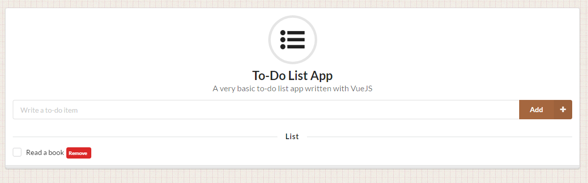

# Vue To-Do App

> A very basic to-do list app written with VueJS.

The to-do list is storing in the localStorage.

[Live Demo](https://erenhatirnaz.github.io/vue-todo-app)

## Requirements

* Python (for using `SimpleHTTPServer` in `Makefile`)

## Usage

```sh
$ git clone https://github.com/erenhatirnaz/vue-todo-app.git
$ cd vue-todo-app
$ make serve
```

and open `localhost:3000` in the your favorite browser.

## Screenshot



## License

MIT © [Eren Hatırnaz](https://github.com/ErenHatirnaz)
